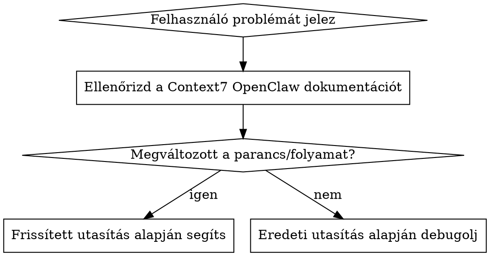
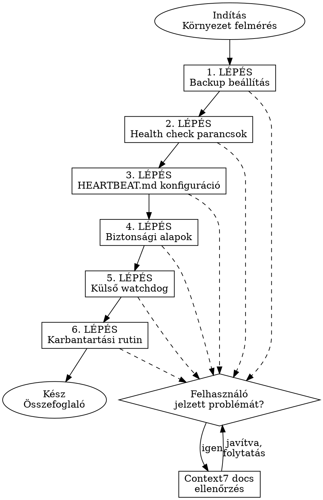

# OpenClaw Karbantartás Varázsló

Interaktív skill, ami lépésről lépésre végigvezeti a felhasználót az OpenClaw backup, health check, biztonság és karbantartás beállításán.

## Nyelv

Ez a skill MINDIG magyarul kommunikál a felhasználóval, minden kérdés, válasz és utasítás magyarul legyen.

## Hibakezelés — KÖTELEZŐ



**Ha a felhasználó bármilyen hibát, problémát vagy váratlan viselkedést jelez:**

1. **ELŐSZÖR** keresd meg az aktuális OpenClaw dokumentációt a Context7 MCP szerveren (`resolve-library-id` → `query-docs` az adott témához)
2. Az OpenClaw dokumentáció gyakran frissül — a parancsok, flag-ek és folyamatok változhatnak
3. Ha a dokumentáció eltér az itt leírtaktól, a **dokumentáció az irányadó**
4. Magyarázd el a felhasználónak, ha valami változott a legutóbbi frissítés óta
5. Ha a Context7 nem elérhető, kérd meg a felhasználót, hogy futtassa: `openclaw docs <topic>` vagy nézze meg a https://docs.openclaw.ai oldalt

## Folyamat



### Indítás — Környezet felmérés

Mielőtt bármit csinálnál, kérdezd meg:

1. **Hol fut az OpenClaw?** (VPS, Mac Mini, saját gép, Docker, Zeabur stb.)
2. **Milyen OS?** (Linux/macOS/Windows)
3. **Van-e SSH hozzáférésed a szerverhez?**
4. **Milyen csatornákat használsz?** (WhatsApp, Telegram, Discord stb.)
5. **Van-e már backup megoldásod?**
6. **Mennyire vagy tapasztalt a terminál/parancssor használatában?** (kezdő/haladó)

A válaszok alapján szabd testre a lépéseket. Ha kezdő, adj részletesebb magyarázatot. Ha haladó, legyél tömör.

### 1. LÉPÉS: Backup beállítás

**Cél:** Napi automatikus mentés, ami túlél egy szerver-összeomlást.

Két megközelítés közül válasszon a felhasználó:

**A) Git-alapú backup (ajánlott)**
- Privát GitHub repo létrehozása
- SSH deploy key beállítása (NE személyes SSH kulcs)
- Az OpenClaw agent-nek adj promptot a backup cron job létrehozásához:

```
Állíts be egy napi automatikus git backup-ot a workspace-ről a GitHub repómba.
Használj SSH deploy key-t. A backup fusson minden éjjel éjfélkor.
Tartalmazzon mindent a ~/.openclaw mappából, kivéve a logs és media mappákat.
Ha nincs változás, ne commitolj.
```

- Ellenőrzés: másnap nézze meg a GitHub repót

**B) Tar archive backup (egyszerűbb, de kézi)**
```bash
tar -czvf openclaw-backup-$(date +%F).tar.gz ~/.openclaw
```
- Fontos: a mentést ki kell vinni a szerverről (Google Drive, S3, másik gép)

**Kérdezd meg a lépés végén:**
> Sikerült a backup beállítása? Van valami hibaüzenet vagy probléma?

Ha probléma van → **Hibakezelés** blokk (Context7 docs ellenőrzés).

### 2. LÉPÉS: Health check parancsok megismerése

Mutasd be az 5 legfontosabb parancsot, és kérd meg, hogy próbálja ki mindegyiket:

| Parancs | Mire való |
|---------|-----------|
| `openclaw status` | Gyors áttekintés |
| `openclaw status --deep` | Élő csatorna-tesztek |
| `openclaw doctor` | Diagnosztika |
| `openclaw doctor --fix` | Automatikus javítás |
| `openclaw health --json` | Gateway állapot JSON-ben |

Kérd meg, hogy futtassa: `openclaw status --deep` és ossza meg az eredményt.

Az eredmény alapján:
- Ha minden OK → tovább a következő lépésre
- Ha WARN vagy CRITICAL van → segíts megoldani, mielőtt továbbléptek
- Ha a parancs nem működik vagy lefagy → **Hibakezelés** (Context7 ellenőrzés, ismert bug: #11843)

### 3. LÉPÉS: HEARTBEAT.md beállítása

Magyarázd el, hogy a HEARTBEAT.md az agent automatikus ellenőrzési listája, ami alapból 30 percenként fut.

Adj promptot amit az agent-nek küldhet:

```
Állítsd be a HEARTBEAT.md fájlt:
- Minden heartbeat: ellenőrizd a csatornák működését, nézd meg van-e hiba a logokban
- Naponta egyszer: futtasd a git backup-ot, ellenőrizd a tegnapi backup sikerességét
- Hetente: security audit összefoglaló
Csak akkor értesíts, ha probléma van. Ha minden rendben, ne küldj üzenetet.
```

Kérdezd meg: sikerült? Az agent válaszolt és beállította?

### 4. LÉPÉS: Biztonsági alapbeállítások

Három dolgot ellenőrizz:

**A) Fájljogosultságok:**
```bash
stat -c "%a" ~/.openclaw/openclaw.json  # 600 kell legyen
```
Ha nem 600: `chmod 600 ~/.openclaw/openclaw.json`

**B) Security audit:**
```bash
openclaw security audit
```
Kérd meg, hogy ossza meg a CRITICAL és WARN tételeket. Segíts megoldani.

**C) Gateway binding:**
A gateway CSAK localhost-on futhat. Ha publikusan elérhető, az kritikus biztonsági rés.

Ha bármit nem ért vagy hibát kap → **Hibakezelés** blokk.

### 5. LÉPÉS: Külső watchdog

Magyarázd el miért kell: ha az OpenClaw leáll, a saját cron job-jai sem futnak, ezért kell valami, ami kívülről figyeli.

**Egyszerű megoldás — watchdog szkript:**

```bash
#!/bin/bash
# openclaw-watchdog.sh
if ! openclaw health --json --timeout 10000 > /dev/null 2>&1; then
    echo "[$(date)] Gateway nem valaszol, ujrainditas..."
    openclaw gateway restart
fi
```

Crontab-ba: `*/5 * * * * /path/to/openclaw-watchdog.sh >> /tmp/openclaw-watchdog.log 2>&1`

**Haladó megoldás:** említsd meg a ClawGuard skill-t (clawhub.ai/camopel/openclaw-claw-guard), ami config-mentéssel és automatikus visszaállítással is rendelkezik. Ez külön szolgáltatásként fut, nem az OpenClaw részeként.

Kérdezd meg melyiket szeretné, és segíts beállítani.

### 6. LÉPÉS: Karbantartási rutin összefoglalása

Foglald össze személyre szabottan, az alapján amit a beállítás során megtudtál:

**Napi (automatikus, az agent csinálja):**
- HEARTBEAT.md alapú ellenőrzések
- Csak akkor kapsz üzenetet, ha baj van

**Frissítés után (kézi, 2 perc):**
```bash
openclaw update
openclaw doctor --fix
```
Hangsúlyozd: ez KÖTELEZŐ minden frissítés után.

**Heti (az agent csinálja, te átnézed):**
- Security audit összefoglaló
- Ha az agent küld WARN/CRITICAL-t, foglalkozz vele

**Havi (kézi, 10 perc):**
- Telepített skill-ek átnézése
- API kulcsok rotálása ha új skill-t telepítettél
- Git backup repo méret ellenőrzése
- Opcionális: backup visszaállítás teszt

### Befejezés

Adj egy rövid összefoglalót arról, hogy mi lett beállítva és mi a felhasználó dolga. Formátum:

```
BEÁLLÍTVA:
  - [x] vagy [ ] Backup (git/tar)
  - [x] vagy [ ] Health check parancsok kipróbálva
  - [x] vagy [ ] HEARTBEAT.md konfigurálva
  - [x] vagy [ ] Biztonsági audit lefuttatva
  - [x] vagy [ ] Watchdog beállítva
  - [x] vagy [ ] Karbantartási rutin megbeszélve

A TE DOLGOD:
  - openclaw doctor --fix minden frissítés után
  - Havi skill-átnézés
  - Ha az agent hibát jelez, foglalkozz vele

AZ AGENT DOLGA:
  - Napi health check + backup
  - Heti security audit
  - Értesítés ha baj van

KÜLSŐ WATCHDOG:
  - Gateway ellenőrzés 5 percenként
  - Automatikus újraindítás
```

## Fontos szabályok

1. **Mindig egy lépést csinálj egyszerre.** Ne ugorj előre. Várd meg a felhasználó visszajelzését.
2. **Minden lépés végén kérdezz rá:** "Sikerült? Van valami hiba vagy kérdés?"
3. **Ha a felhasználó problémát jelez → MINDIG ellenőrizd a Context7 dokumentációt először.** Az OpenClaw gyorsan fejlődik, a parancsok és flag-ek változhatnak.
4. **Ha valami nem egyezik a dokumentációval, mondd el a felhasználónak** hogy mi változott és mi az aktuális megoldás.
5. **Ne feltételezd, hogy a felhasználó tudja mi az SSH, cron, vagy systemd.** Ha kezdőnek vallotta magát, magyarázd el egyszerűen.
6. **Ha egy lépés nem releváns** (pl. Docker-en fut és nem kell systemd watchdog), ugorj át és magyarázd meg miért.
